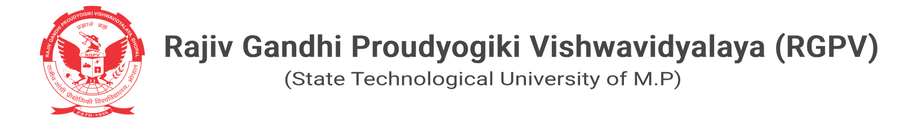

<h1 text-aling="center">Yogesh Yadav</h1>

  
  

<h3>I Am BTech CSE Student Studying in Indore Institute Of Science & Technology (Affiliated with Rajv Gandhi Proudyogiki Vishwavidhyalaya) Having (NBA Accredidation & NAAC A+ grade ) in rau-indore region . </h3>

  

  
  

I am MERN Framework developer with great hands on java (JDK 26 Latest) programming language having 2 years experience which i build from self study & college workshops . 
I have also hands on below languages : 
1. C Language
2. C++ Language (Oops Parts)
3. SQL Data Base
4. Pyhton version 3.17.0

Currenlty i am working on Web Dev Scenarios . Where i learn about flow of databse in backend & how's our frontend part helps to rectify & solving complex evnets with users . 
working with these frame works 
1. Node.js (Local Server Support)
2. React.js / Angular.js
3. MongoDB (Data Management)
4. Express.js
5. Rest APIs ( For Transferring data from server to frontend)
